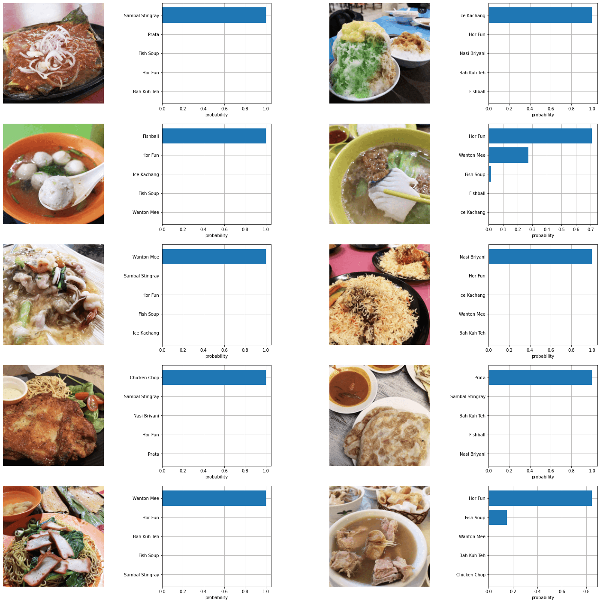

OpenAI just released [CLIP](https://openai.com/blog/clip/), an image classification model displaying remarkable "zero-shot" capabilities.

_Zero-shot_ refers the capability of machine learning models to perform unseen tasks, i.e. to do things the model was not explicitly trained to do. In a sense, a model's zero-shot capability also reveals the model's robustness and ability to generalise.

I was curious as to how well CLIP would perform on labelling images of Singapore hawker food. My motivations are:

1. Food classification is a relatively popular beginner machine learning project, with plenty of resources online on how to build one. However, when it comes to Singapore hawker food, there is no public dataset readily available. With zero-shot transfer, this problem is removed. All we need are labels, i.e. names of hawker dishes.
2. CLIP was trained on labels from the internet, which we can assume are predominantly English words. I was curious to see how well CLIP would perform on non-English words.

Thankfully, OpenAI has made their model [publicly available](https://github.com/openai/CLIP), with easy to use APIs for building a simple prediction pipeline.

I then grabbed some photos from my friend, who runs a [food review instagram account](https://www.instagram.com/jasoneatfoodd/) and ran them through the model, along with a list of names of hawker food:

```python
labels = ['White Chicken Rice', 'Roasted Chicken Rice','Laksa','Hokkien Mee',
'Nasi Lemak','Prata','Ban Mian','Black Carrot Cake','White Carrot Cake',
'Lor Mee', 'Chicken Chop','Kway Chap', 'Maggi Goreng',
'Kaya Toast','Sambal Stingray']
```
<br>
And here's how the model performed:

<figure>
    
    <figcaption>CLIP predictions on hawker food</figcaption>
</figure>

It turned out that CLIP was able to identify a majority of the hawker foods, such as _chicken chop_, _sambal stingray_ and even _ice kachang_. It was even able to correctly label certain food items that had no english words in them at all, such as _prata_, _nasi briyani_ and also _wanton mee_. 

However, CLIP was unable to correctly label _hor fun_, _fish soup_ and _bah kuh teh_. I would attribute it to their visual similarity (they are all kinda soupy).

Of course, more experiments can be done to tease out the latent representations in the CLIP model. Like can it [recognise the difference between white and roasted chicken rice](https://blog.usejournal.com/i-made-a-machine-learning-chicken-rice-classifier-in-4-hours-to-tell-me-what-type-of-chicken-rice-e9b1af4aa069?gi=f21e18c680bd)? What if we used westernised names such as replacing "bah kuh teh" with "pork rib herbal soup"?

In the end, this little experiment shows that CLIP is passable as a zero-shot hawker food classifier. The ability to quickly build a classifier without having to go through the hassle of collecting and cleaning training data is really quite revolutionary as an  education and experimentation tool for people who just want to mess about machine learning's capabilities.