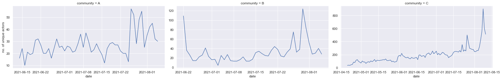
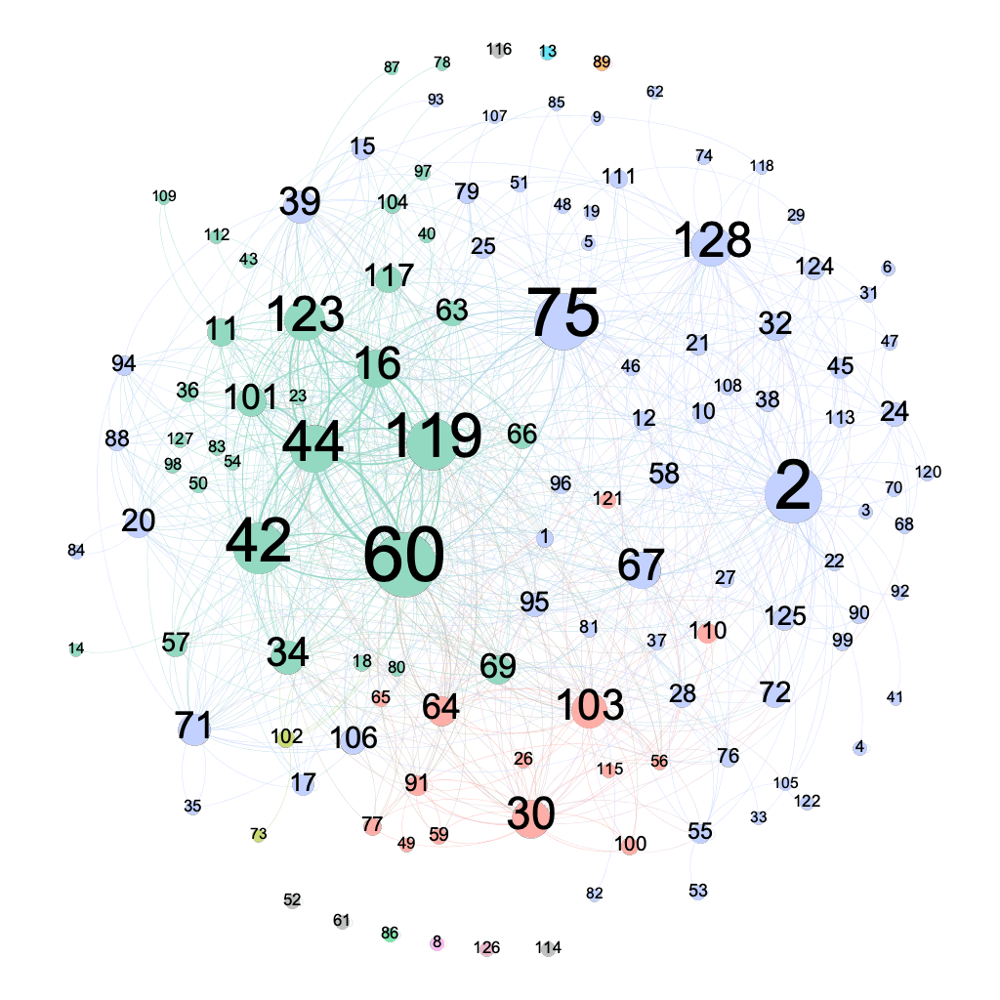
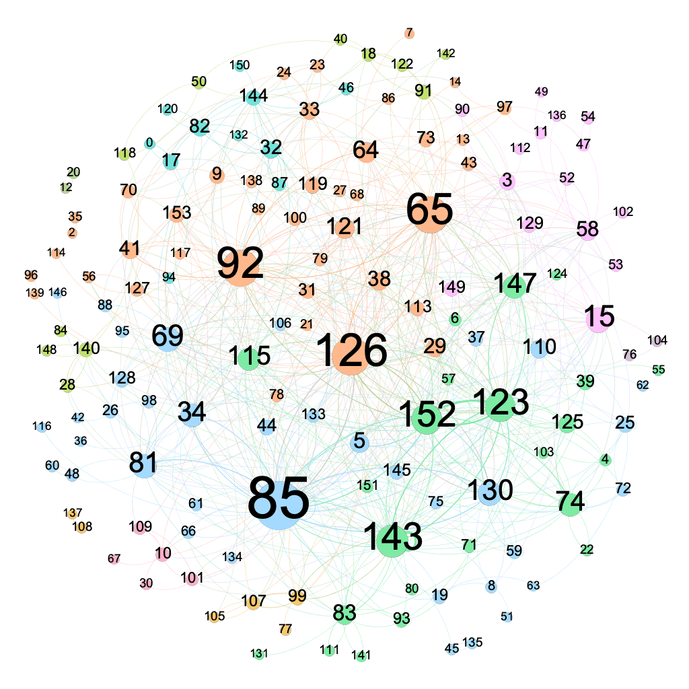
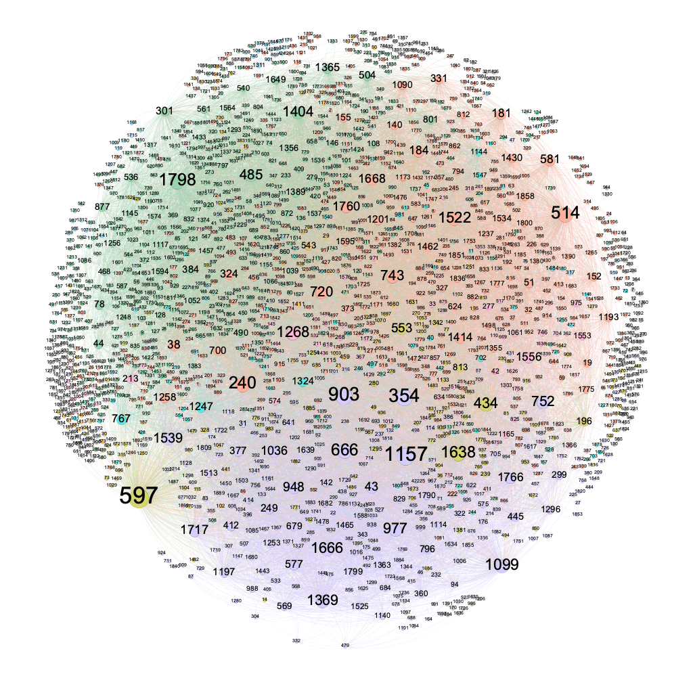
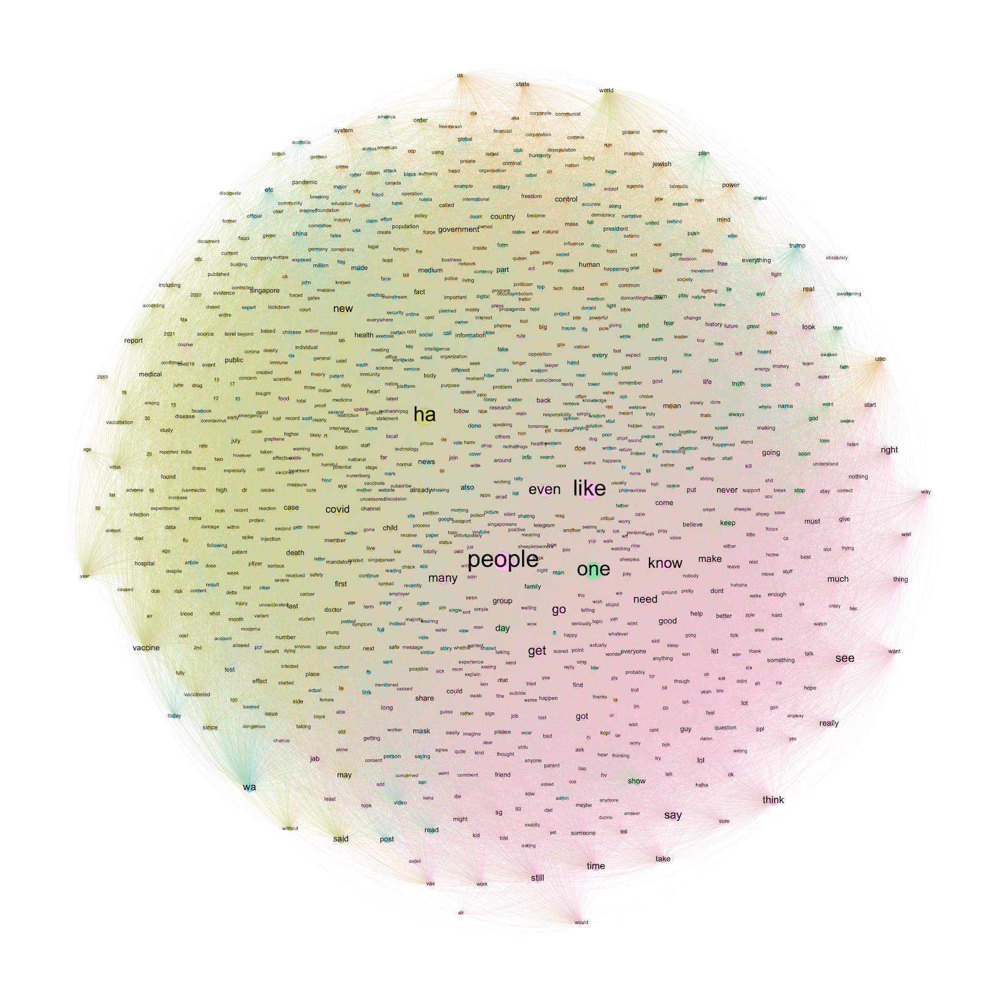
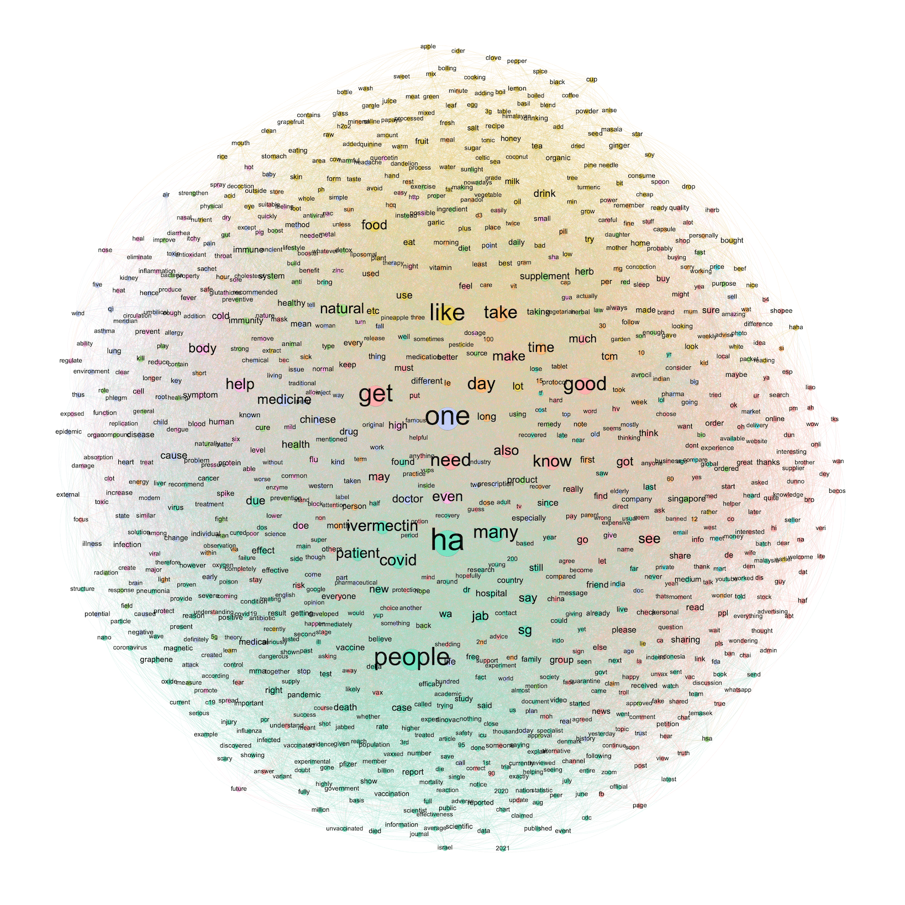
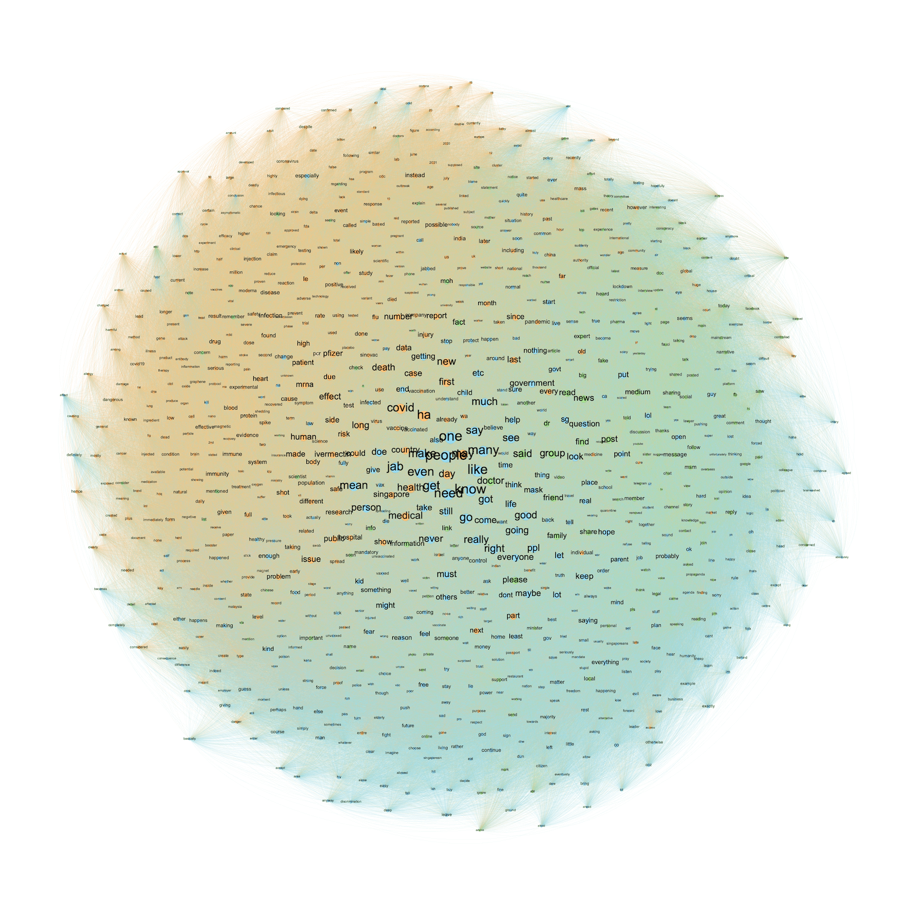

Even as Singapore climbs it way to be [the most vaccinated country](https://www.nytimes.com/interactive/2021/world/covid-vaccinations-tracker.html), a number of local anti-vax communities have emerged on messaging platform Telegram.

<blockquote class="twitter-tweet">
Commentary: Misinformation threatens Singapore’s COVID-19 vaccination programme <a href="https://t.co/6sA9WypCbE">https://t.co/6sA9WypCbE</a> <a href="https://t.co/gsnihNafG4">pic.twitter.com/gsnihNafG4</a>
&mdash; CNA (@ChannelNewsAsia) <a href="https://twitter.com/ChannelNewsAsia/status/1348759361674309634?ref_src=twsrc%5Etfw">January 11, 2021</a></blockquote> 

Arguably, Telegram packs features that enable the spread of misinformation more effectively than other messaging platforms such as WhatsApp.

<blockquote class="twitter-tweet">
🧵 WhatsApp as a propaganda distribution channel might be slowing down (as one pol functionary told me a majority of groups are muted by users)   Engagement with content is not as much in real-time as it used to be. Shares do happen. But that depends on when folks engage w/ it
&mdash; Venkat Ananth (@venkatananth) <a href="https://twitter.com/venkatananth/status/1357923318356037637?ref_src=twsrc%5Etfw">February 6, 2021</a></blockquote> 

On the other hand, Telegram's features also makes it easier to study these communities. New users are not restricted access to old messages, meaning that the community's whole history is exposed to anyone. Telegram's desktop application even allows exporting chat history in machine-readable JSON format.

In this post, I'll explore how network visualisation can be used to understand anti-vax communities in Singapore. In particular, I'll look at three SG anti-vax communities that range in age and size.

## Introduction

Out of the three communities, two were of similar in age and size, while the third community was the oldest and significantly larger.

| Community | Age             | Size  |
------------|-----------------|-------|
| A         | 16th June 2021  | 500   |
| B         | 22nd June 2021  | 730   |
| C         | 20th April 2021 | 7.6k  |

When we plot the activity of unique users over time however, we see positive growth across all three communities.

<figure>
    
    <figcaption>No. of actors over time</figcaption>
</figure>

## The Social Network of an Anti-Vax Community

In a social network, each actor in the community is represented by a node. Each edge represents a user interaction between two actors, which can be a mention, reply, or invitation. The size of the node is proportional to its [out-degree](https://en.wikipedia.org/wiki/Directed_graph#Indegree_and_outdegree), meaning that a larger node interacts with more members in the community. Using [modularity clustering](https://en.wikipedia.org/wiki/Modularity_(networks)), the network has been segmented into community clusters. Open source visualisation software [Gephi](https://gephi.org/) was used to visualise the network.

The social networks of each of the communities are thus presented.

<figure>
    
    <figcaption>Social network of community A</figcaption>
</figure>

<figure>
    
    <figcaption>Social network of community B</figcaption>
</figure>

<figure>
    
    <figcaption>Social network of community C</figcaption>
</figure>

The social network of each community is significantly smaller as we only consider actors that interact with each other. That is, we filter out lurkers (also called isolates) within the communities.

Within each network, a set of actors can be identified as more active in interacting with other members. Not only are they active in socialising with more diverse members, they also interact with each other more frequently, constituting a broadcast group (e.g. the green cluster in community A).

However, as the group grows in size, such as in community C, the number of active members grow and there are less strong ties within the community, active members interact with a diverse group instead of gathering into sub-communities. It becomes harder to point out individuals responsible for the spread of mis-information.

## The Word Network of an Anti-Vax Community

To get insight into the conversations that happen within a community, we can use a word co-occurrence network to visualise how words are used in relation to each other in the community. This allows us to identify key topics of conversation, revealing the diversity of topics within the community.

To improve the interpretability of the network, only the top 1000 most frequently occurring word was used in the construction of the network.

<figure>
    
    <figcaption>Word co-occurrence network of community A</figcaption>
</figure>

Within community A, there are 3 prominent clusters. The first cluster (green) pertains to medical information such as information on vaccines and the covid virus. The second cluster (pink) pertains to community actions, including advice, personal opinions, and requests. The third cluster (blue) pertains to news and media, including geopolitical topics.

<figure>
    
    <figcaption>Word co-occurrence network of community B</figcaption>
</figure>

Community B exhibits more distinct clustering. The green cluster pertains to information on vaccines and the pandemic, such as death counts, vaccination reports, and case updates. The yellow cluster pertains to alternative medicine, including organic ingredients and home remedies. The pink cluster pertains to symptoms and negative reactions. It becomes clear that community B has a specific interest in alternative remedies and anxiety over the side-effects of the vaccine.

<figure>
    
    <figcaption>Word co-occurrence network of community C</figcaption>
</figure>

Finally, community C exhibits the same clusters as community A, though the clusters are less distinct given the more diverse conversations that result from the larger size of the group.

Generally, within anti-vax communities in Singapore, members use reports on negative symptoms to view vaccines in negative light. Vaccines are often mentioned together with words such as toxic, risks, and experimental. How vaccines might negatively affect the body is a topic discussed in detail, with specific references to organs in the body such as the liver or heart, as well as detailed symptoms such as fever and stroke. Alternative treatments also appears as a topic—community B is distinct in its interest in home-based natural remedies. 

Finally, there is frequent requests for more information, as well as encouragement to share misinformation, targeting friends and families. Evidently, these channels are significant sources of misinformation.