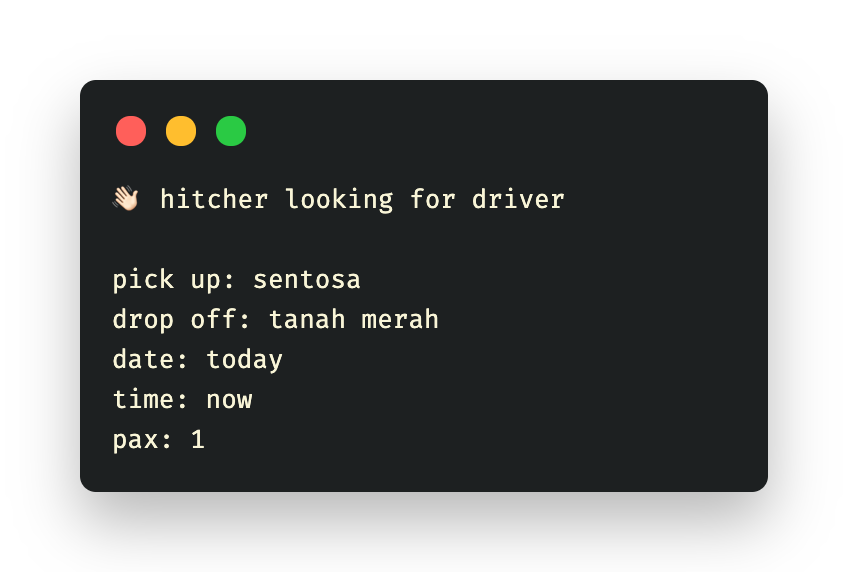
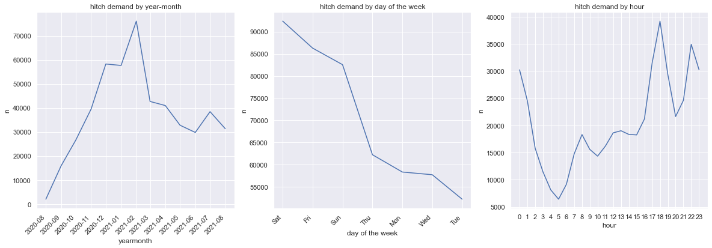
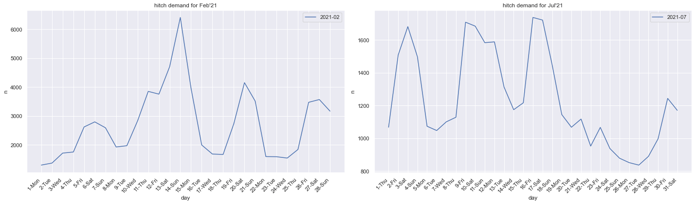
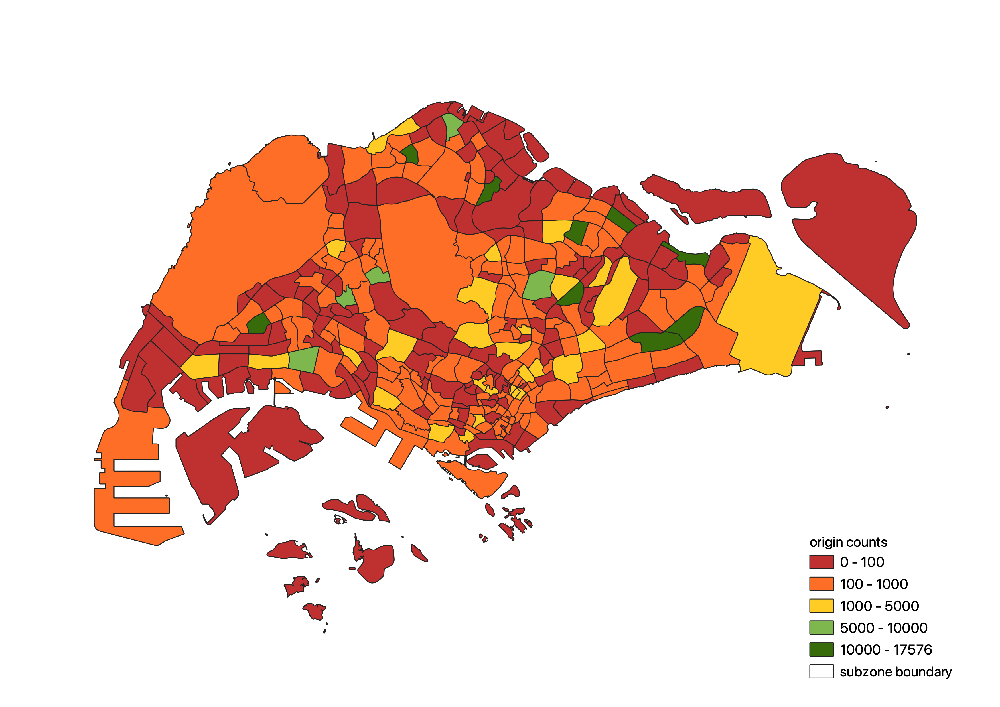
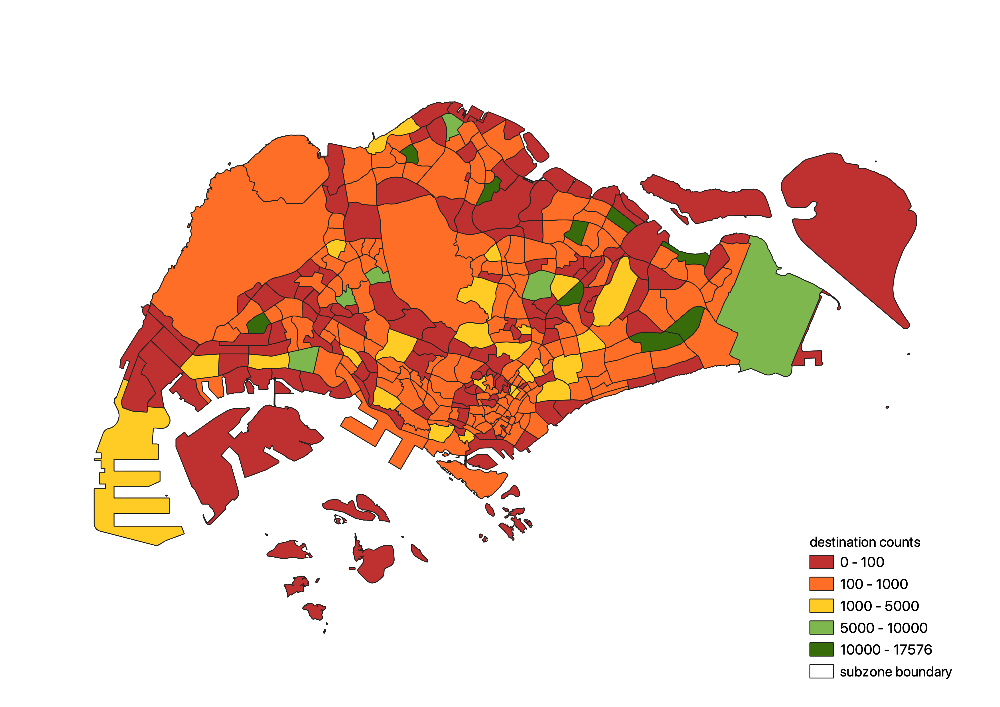
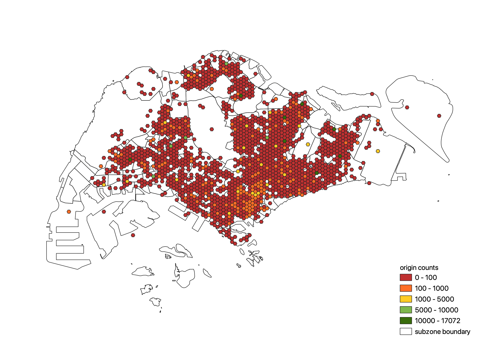
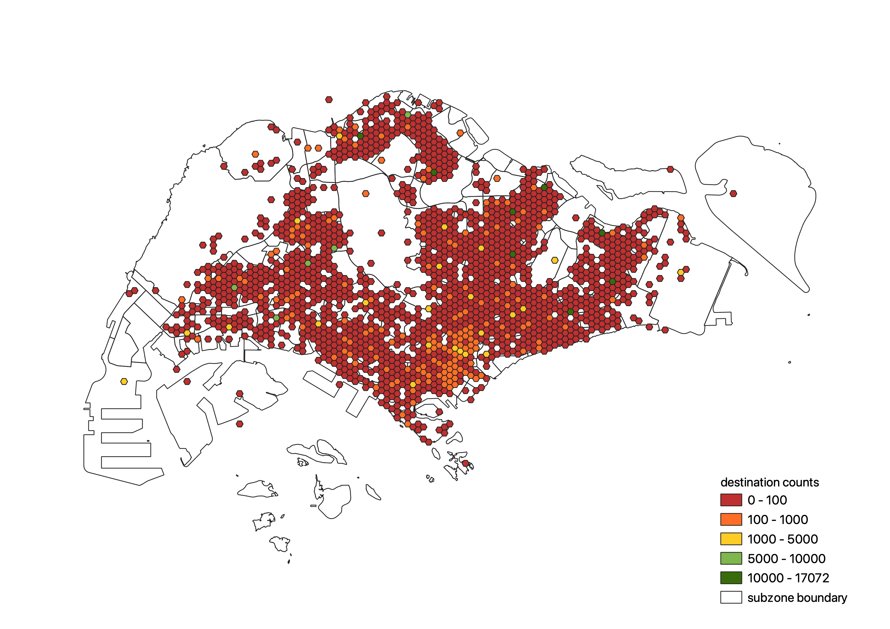
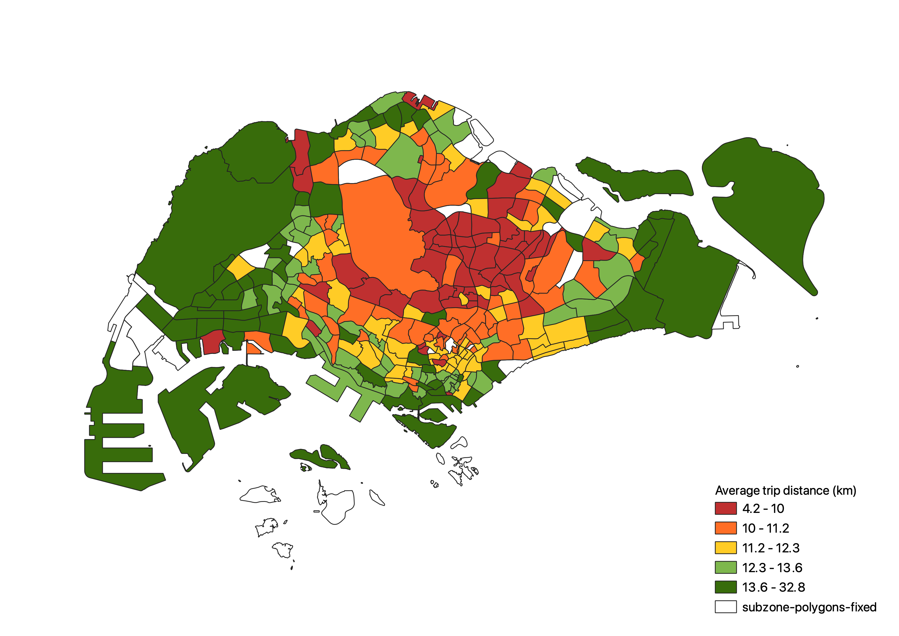
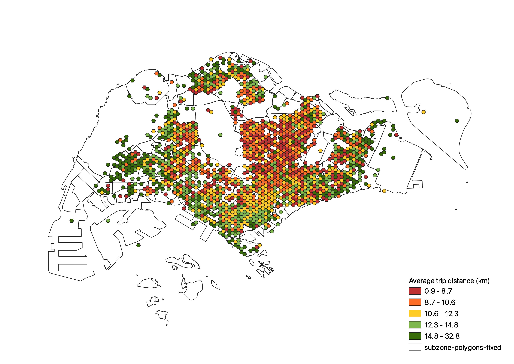

Early 2019, a [carpooling telegram group made headlines](https://www.straitstimes.com/singapore/transport/new-carpooling-service-in-telegram-chat-group-draws-1300-members-in-2-weeks) as a competitive service to the dominant ride-sharing services in Singapore. (Toh, 2019) The next year, [such groups were banned](https://www.tnp.sg/news/singapore/private-carpooling-services-still-demand-despite-ban) as part of Singapore's health safety measures against the Covid-19 pandemic. (Devaraj, 2021) However, this has not stopped these communities from operating business-as-usual, albeit the adoption of anti-surveillance measures such as daily data erasure policy and carrying out transactions over private messaging. The supposed cheaper rates that these platforms offer continues to generate demand for private carpooling and activity within these unofficial communities.

Hence, these private hitch telegram groups generate an unaccounted demand for private carpooling that is not insignificant, with some communities having sizes of up to 60,000 members. These communities offer potential insight on ride-sharing demand in Singapore. In addition, these telegram groups serve as a potential alternative open mobility data source, in an environment where ride-sharing companies might be less than willing to share their trip data. In this article, I present how these insights can be distilled from the messy textual data of message conversations in a Telegram group.

### About the data

Our data was collected from a private hitch telegram supergroup through the Telegram client which allows exporting of the message history of public groups in JSON format. The message history between August 2020 to August 2021 was extracted, providing a year’s worth of data. Among the messages, hitch requests are of primary interest. Below depicts a typical hitch request.

<figure>
    
    <figcaption>A typical hitch request message.</figcaption>
</figure>

### Methodology

The semi-structured nature of a hitch request eases the data standardisation process. Each hitch request can be interpreted as a trip. Using regex matching, an Origin-Destination (OD) pair can be constructed from the textual content of the hitch request. For simplicity, the date and time when the hitch request was made is treated as the date and time of the trip, given that only a minority of the hitch requests are a scheduled request. It is important to note that these trips represent ridership demand, as each hitch request is not guaranteed to produce a fulfilled trip.

Having extracted the OD pairs, the location names of the pick-up and drop-off exist as unstructured natural text data and thus, needs to be transformed into a standardised geospatial format for analysis. Three different approaches were used for this process.

1. **Postal code extraction**

    Some hitch request messages include the postal code of the pick-up and drop-off locations. Using a simple regex filter, these 6-digit postal codes can be extracted and later used in the OneMap search query for a more successful result.

2. **OneMap API**

    [OneMap](https://www.onemap.gov.sg/home/index.html) by the Singapore Land Authority (SLA) provides a Search API for retrieving geospatial information given a text query or postal code. For simplicity, the first result is taken for each search query. This step also serves as a filter for invalid location names and postal codes. While [Google Map's Place API](https://developers.google.com/maps/documentation/places/web-service/overview) appears to be more robust at handling natural language text queries, the OneMap Search API has the benefit of being free of charge and built for Singapore’s context.

3. **Fuzzy matching of planning area names**

    Some location names might not return a successful result with OneMap’s Search API due to human errors such as spelling mistakes. To account for this, fuzzy matching can be used to compare location names with the list of planning areas in Singapore. The python package TheFuzz was used which employs the Levenshtein distance statistic to calculate the difference between two strings. A threshold score of 90 was set for acceptable results using this method. In these match cases, the centroid of the planning area is used to provide the geospatial information for that location, at the disadvantage of reduced granularity of the data.

As an additional note, some hitch requests consist of multiple possible pick-up or drop-off locations. In these instances, the first location is treated as the origin or destination.

For this analysis, the OD pairs were aggregated into subzones according to the [Singapore 2019 Master Plan]((https://data.gov.sg/dataset/master-plan-2019-subzone-boundary-no-sea)). However, it is worth mentioning that the high granularity of the OD pairs in our data potentially allows for deeper analysis on building-level, by combining with other datasets such as land use characteristics or residential housing data.

### Analysis

Despite the ban on hitch telegram groups, these communities have still been very much active. Within a year, a total of 491,809 trip requests were made in this one Telegram community.

<figure>
    
    <figcaption>Left: Hitch demand by month. Middle: Hitch demand by day of the week. Right: Hitch demand by hour.</figcaption>
</figure>

Hitch ridership demand peaks across the weekends and during the off-work rush hour (5pm to 7pm) though a same preference is not observed for early commute (5am to 7am). In addition, the peak during the late night hours (11pm to 3am) reveals the dependence on private carpooling as an alternative transport mode after public transport services cease operations for the day.

Hitch ridership demand peaked at 76,084 in February 2021, primarily because of the Chinese New Year weekend (as seen below). However, the impact of soft lockdowns onto ridership demand is also visible such as the dip in demand in July (see below) as a result of [heightened safety measures between 22 July to 18 August 2021](https://www.gov.sg/article/as-of-20-july-2021-return-to-phase-2-heightened-alert-measures).

<figure>
    
    <figcaption>Daily hitch demand for Feb'21 and July'21.</figcaption>
</figure>

### Geospatial Analysis

The geospatial visualisations below were produced in QGIS. The following two figures depict the aggregated counts of origins and destinations by subzone level. 

<figure>
    
    <figcaption>Origin counts</figcaption>
</figure>

<figure>
    
    <figcaption>Destination counts</figcaption>
</figure>

From the figures above, we can see that residential districts such as the bedok region and ang mo kio regions are both strong attractors and generators of ridesharing trips. In addition, Changi Airport on the extreme east of the island and Tuas on the extreme right are also strong attractors of trips.

Alternatively, the origin and destination counts can be aggregated into a grid of 400m wide hexagon for higher granularity, as seen in the following two figures. However, in this instance, the use of centroids as placeholder locations for certain OD trips distorts visualisation using this approach, though this could be resolved through a smoothing function over hexagons belonging to the same planning area.

<figure>
    
    <figcaption>Origin counts</figcaption>
</figure>

<figure>
    
    <figcaption>Destination counts</figcaption>
</figure>

We can also visualise the average trip distance from origin to destination. As seen below, trips that originate from the edges of Singapore such as Changi, Tuas or Woodlands have on average larger trip distane than trips originating from heartlands such as the Ang Mo Kio and Bishan region.

<figure>
    
    <figcaption>Average trip distance (km) from origin to destination.</figcaption>
</figure>

<figure>
    
    <figcaption>Average trip distance (km) from origin to destination.</figcaption>
</figure>

Interestingly enough, the Central Business District performs average as a trip generator and attractor for private carpooling. This could hint towards the population demographic that makes use of these unofficial private ridesharing services as opposed to the established ridesharing services.

---
This post adds to a collection of studies exploring Telegram groups as rich sources of urban insight for policy and planning. If you enjoyed this post, do check out these other posts:

- [Visualising the talk in Singapore's anti-vax communities](https://vnck.xyz/projects/visualising-singapore-anti-vax-communities)
- [An exploratory study on digital sharing communities](https://vnck.xyz/digital-sharing-communities-study/)
