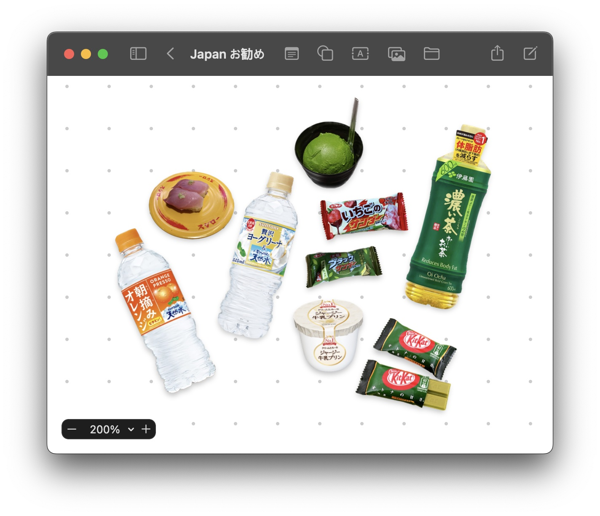

My history with life-tracking starts with a journal I kept during my two years of national service—a Muji B5 grid-paper ring-notebook. It's the only journal that I've managed to fill, and those 2 years of my life, the most well-documented. Naturally, I failed to carry the habit into my years of university because ultimately journaling takes time, which I had plenty of in service, but never enough in university.

---

As of this year, I started using 3 apps to track 3 different aspects of my life.

### Reading

I try to read 50 books a year and I started keeping tally through GoodReads. I discovered StoryGraph last year and ported over and it has been good for me thus far, with an overall better user experience.

You can find me [@vvvnck](https://app.thestorygraph.com/profile/vvvnck)

### Exercise

I've started using [Hevy](https://www.hevyapp.com/) to keep track of my sets. Honestly, I don't know what took so long but now I at least a more concrete way to track progress. The UI is great and even on the free-tier, the features offered are more than enough.

### Shopping

I've started using a combination of Apple's Freeform and Lift Subject from Photo feature to create moodboard-esque wishlists.

<figure>
    
    <figcaption>A board for おすすめ in Japan</figcaption>
</figure>
